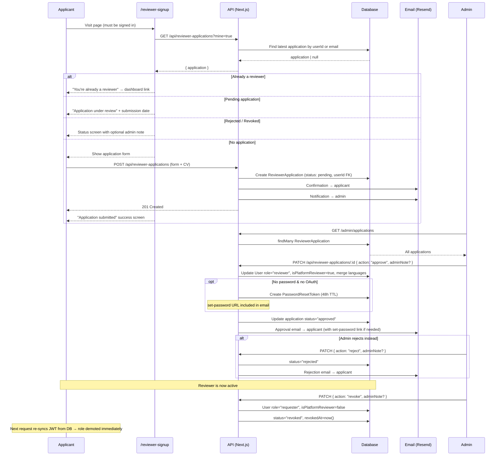

# Summon Translator

AI-powered translation platform with human reviewer oversight.

---

## Reviewer Onboarding Process

Reviewers are freelance MT Post-Editors and LQA specialists who review AI-translated projects on the platform. The flow below covers the full lifecycle: application → approval → access revocation.

### Actors

| Actor | Description |
|---|---|
| **Applicant** | A logged-in user who wants to become a reviewer |
| **Admin** | Platform staff with `role = "admin"` |
| **System** | Automated actions (email, DB writes, JWT re-sync) |

### Step-by-step

#### 1. Application submission (`/reviewer-signup`)
- The applicant must be signed in. Unauthenticated visitors see a login gate.
- On load the page calls `GET /api/reviewer-applications?mine=true` and shows a role-aware state:
  - **Already a reviewer** → redirects to dashboard
  - **Pending application** → shows submission date and "we'll email you" message
  - **Rejected application** → shows rejection reason (if any)
  - **Revoked access** → shows revocation note (if any)
  - **No application** → shows the form
- The email field is read-only and locked to the session account.
- On submit, `POST /api/reviewer-applications` stores the application with `userId` (FK to the user's account) and `status: "pending"`.
- System sends a **confirmation email** to the applicant and an **admin notification email**.

#### 2. Admin review (`/admin/applications`)
- The admin sees all applications grouped by status (pending / approved / rejected / revoked).
- Expanding an application shows full details: bio, CV download, language pairs, rates, CAT tools.
- The admin can add an **internal note** (shown to the applicant on reject/revoke) before acting.

#### 3. Approve
- `PATCH /api/reviewer-applications/:id { action: "approve" }` is called.
- The system looks up the linked user account (by `userId` FK, falling back to email).
  - If the user already has a `reviewer` role → language pairs are merged; approval email re-sent.
  - Otherwise → `role` is set to `"reviewer"`, `isPlatformReviewer = true`, languages merged.
- If the user has **no password and no OAuth account**, a **set-password link** is generated (48-hour TTL) and included in the approval email so they can create login credentials.
- Application status → `"approved"`.

#### 4. Reject
- `PATCH /api/reviewer-applications/:id { action: "reject" }` is called.
- Application status → `"rejected"`. Rejection email sent with optional admin note.
- The applicant sees the rejection reason on `/reviewer-signup`.

#### 5. Active reviewer
- The reviewer logs in and their JWT session reflects `role: "reviewer"` immediately.
- Session tokens are re-synced from the database on every request, so role changes by admins take effect within one page load — no re-login required.

#### 6. Revoke access
- Admin clicks **Revoke reviewer access** on an approved application.
- `PATCH /api/reviewer-applications/:id { action: "revoke" }` is called.
- User `role` → `"requester"`, `isPlatformReviewer` → `false`.
- Application status → `"revoked"`. The revocation note is shown on `/reviewer-signup`.

---

### Flow diagram



---

### Key implementation files

| File | Purpose |
|---|---|
| `prisma/schema.prisma` | `ReviewerApplication` model with `userId` FK, `adminNote`, `revokedAt`, `status` enum |
| `src/lib/auth.ts` | JWT callback re-syncs `role` from DB on every request |
| `src/app/api/reviewer-applications/route.ts` | `POST` (create), `GET ?mine=true` (applicant status check), `GET` (admin list) |
| `src/app/api/reviewer-applications/[id]/route.ts` | `PATCH` with `approve` / `reject` / `revoke` actions |
| `src/app/reviewer-signup/page.tsx` | Applicant-facing form with role-aware state machine |
| `src/components/application-manager.tsx` | Admin review UI with approve / reject / revoke actions and admin notes |

---

This is a [Next.js](https://nextjs.org) project bootstrapped with [`create-next-app`](https://nextjs.org/docs/app/api-reference/cli/create-next-app).

## Getting Started

First, run the development server:

```bash
npm run dev
# or
yarn dev
# or
pnpm dev
# or
bun dev
```

Open [http://localhost:3000](http://localhost:3000) with your browser to see the result.

You can start editing the page by modifying `app/page.tsx`. The page auto-updates as you edit the file.

This project uses [`next/font`](https://nextjs.org/docs/app/building-your-application/optimizing/fonts) to automatically optimize and load [Geist](https://vercel.com/font), a new font family for Vercel.

## Learn More

To learn more about Next.js, take a look at the following resources:

- [Next.js Documentation](https://nextjs.org/docs) - learn about Next.js features and API.
- [Learn Next.js](https://nextjs.org/learn) - an interactive Next.js tutorial.

You can check out [the Next.js GitHub repository](https://github.com/vercel/next.js) - your feedback and contributions are welcome!

## Deploy on Vercel

The easiest way to deploy your Next.js app is to use the [Vercel Platform](https://vercel.com/new?utm_medium=default-template&filter=next.js&utm_source=create-next-app&utm_campaign=create-next-app-readme) from the creators of Next.js.

Check out our [Next.js deployment documentation](https://nextjs.org/docs/app/building-your-application/deploying) for more details.


https://claude.ai/public/artifacts/dfcab2ad-ff14-4b9d-b7d1-51c6208eeb4c
https://claude.ai/public/artifacts/604268a3-2e71-41d2-bb68-2ab1a35d188d


2. Invoice PDF says "Jendee AI" + wrong support email
src/app/billing/page.tsx — downloadable invoices have old branding and support@jendeeai.com.

3. Promo code inconsistency
Login page shows 1TIME, wizard shows SPRINT is alwasy usable not one time only.

3.1 
please disable the stripe testing credit card, 4242 4242 4242 4242, and how to check if user actually pay for the service?


🟡 High (will hurt conversion)


6. GitHub PR write-back claims it pushes files back automatically
The help text says "translated files are pushed back to the PR branch automatically" — but this isn't implemented. please build it and change the copy to "download and commit manually."

7. $5 minimum fee is a surprise
Users submitting small files only discover the $5 minimum at Step 3. Show it earlier — e.g. in Step 2 or the cost estimator on the login page.

8. No pagination on My Jobs
Power users with many jobs will see a slow, endless list.

🟢 Polish (nice before launch)

10. No empty state for new users on My Jobs — currently shows a blank table
11. Glossary feature is hidden — collapsed by default, most users will miss it, please uncollapse by default


Protofolio
source:
https://arena.gov.au/assets/2024/11/Rio-Tinto-and-Sumitomo-Yarwun-Hydrogen-Calcination-Pilot-Demonstration-Program-Lessons-Learnt-Report-2.pdf
Translated:
file:///Users/mahdykhayyamian/Downloads/Rio-Tinto-and-Sumitomo-Yarwun-Hydrogen-Calcination-Pilot-Demonstration-Program-Lessons-Learnt-Report-2-zh-CN.pdf